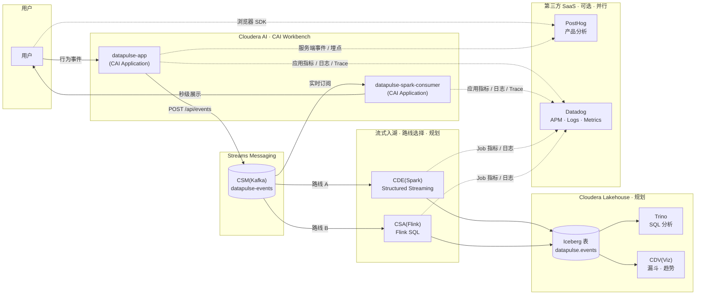

# DataPulse

基于 PostHog 的用户行为分析 Demo 应用。在网站上进行点击、浏览、表单提交等操作，事件会实时显示在右下角的事件采集面板中，并可同步到 PostHog 云端；在 Cloudera AI 上还可将事件写入 Kafka，并由 Spark Consumer Application 实时展示。

## 最终架构

DataPulse 在 Cloudera 平台上的目标形态：**实时事件链路**（已落地）+ **湖仓沉淀与分析**（规划扩展）。Kafka 作为统一事件总线；流式入湖可在 **CDE(Spark)** 与 **CSA(Flink)** 两条路线中择一。



### 平台组件

| 层级 | 组件 | Blueprint / 服务 | 状态 |
|------|------|------------------|------|
| 应用托管 | CAI Workbench | `cai` | ✅ 已部署 |
| 事件生产 | datapulse-app (CAI Application) | CAI Application | ✅ 已验证 |
| 消息总线 | CSM(Kafka) | `csm` | ✅ 已验证 |
| 实时消费 | datapulse-spark-consumer (CAI Application) | CAI Application | ✅ 已验证 |
| 流式入湖 A | CDE(Spark) | `cde-udf` | 📋 规划 |
| 流式入湖 B | CSA(Flink) | `csa` | 📋 规划（与 CDE 二选一） |
| 湖仓存储 | Iceberg 表 | `cloudera-lakehouse-engine-governed` | 📋 规划 |
| SQL 分析 | Trino | Lakehouse Engine | 📋 规划 |
| 可视化 | CDV(Viz) | `cdv` | 📋 规划（可选） |

### CAI Applications

| Application | 启动脚本 | 说明 |
|-------------|----------|------|
| **datapulse-app** | `scripts/cai_start_application.py` | 演示站点 + 事件生产 |
| **datapulse-spark-consumer** | `scripts/cai_spark_kafka_stream.py` | Kafka 消费 + 实时看板 |

Producer / Consumer 通过 Console Access Key 访问 CSM(Kafka)（OAuth）。**无需** `cai-base-connected` Blueprint，除非需对接 on-prem CDP Base 数据湖。

### 三条数据路径

| 路径 | 链路 | 用途 |
|------|------|------|
| **实时路径** | 用户 → datapulse-app → CSM(Kafka) → spark-consumer → 用户 | Demo 演示、秒级反馈 |
| **分析路径** | CSM(Kafka) → CDE(Spark) **或** CSA(Flink) → Lakehouse → Trino / CDV(Viz) | 历史查询、漏斗、留存、报表 |
| **SaaS 路径** | 见下表 | 产品分析、可观测性，与 Cloudera 管道**并行** |

### 第三方 SaaS 接入位置

第三方 SaaS **不替代** CSM / Lakehouse 主链路，而是作为**并行出口**挂载在不同层级：

| 类型 | 代表产品 | 接入点 | 数据内容 | 与主链路关系 |
|------|----------|--------|----------|--------------|
| **产品分析** | PostHog、Mixpanel、Amplitude | ① 用户浏览器（`analytics.js` SDK）<br/>② datapulse-app 服务端 | 点击、浏览、转化等行为事件 | 与 CSM(Kafka) **并行**；可只开 SaaS、只开 Kafka、或双写 |
| **可观测性** | Datadog、Dynatrace、New Relic | ① datapulse-app / spark-consumer（APM、日志、Trace）<br/>② CDE / CSA Job（流处理任务监控）<br/>③ CSM / 平台层（Broker 指标，通常由平台运维配置） | 延迟、错误率、资源用量、日志 | 监控 Cloudera 组件健康，**不承载业务事件分析** |
| **错误追踪** | Sentry | datapulse-app / spark-consumer | 前端 & 后端异常 | 可观测性子类，挂 Application 层 |
| **告警通知** | PagerDuty、Slack | Datadog / 平台告警规则 | 运维告警 | 可观测性下游，非数据管道 |

**设计原则：**

- **PostHog 类产品分析** → 挂在 **用户 / Application 层**，事件语义与业务 KPI 相关，可与 Kafka 双写做「SaaS + 平台内分析」对照演示。
- **Datadog 等可观测性** → 挂在 **Application 与计算 Job 层**，关注 SLI/SLO，不进入 Lakehouse 业务表。
- **Cloudera 主链路**（CSM → Lakehouse → Trino / CDV）负责 **平台内数据资产**；SaaS 负责 **托管分析或运维监控**，职责分离。

## 功能

- **页面浏览追踪** — 自动采集路由切换
- **自定义事件** — 按钮点击、功能使用、方案选择等
- **表单提交** — 模拟订阅表单转化事件
- **用户识别** — PostHog `identify` 演示
- **本地事件面板** — 未配置 PostHog 时也可完整演示

## 快速开始（FastAPI）

```bash
python -m venv .venv
source .venv/bin/activate
pip install -r requirements.txt
uvicorn app.main:app --reload --host 127.0.0.1 --port 8080
```

访问 [http://127.0.0.1:8080](http://127.0.0.1:8080)

## CAI Application 部署

在 Cloudera AI Workbench 中创建 Application 时，使用启动脚本：

```bash
scripts/cai-start-application.sh
```

脚本会读取 `CDSW_READONLY_PORT` 环境变量，并在 `127.0.0.1` 上启动 uvicorn。推荐使用 PBJ Workbench Python 3.11 runtime。

Application 的 `script` 字段应设为 `scripts/cai_start_application.py` 或 `scripts/start_datapulse.py`（PBJ Python runtime 会将脚本作为 Python 代码执行，不能使用 bash 脚本路径；脚本内请使用 `os.getcwd()` 而非 `__file__`，且不要用 `raise SystemExit` 包裹 uvicorn）。

## 配置 PostHog（可选）

1. 在 [PostHog](https://posthog.com) 注册并创建项目
2. 复制 Project API Key
3. 设置环境变量：

```env
POSTHOG_KEY=phc_your_project_api_key_here
POSTHOG_HOST=https://us.i.posthog.com
```

4. 重启应用

配置后，事件面板会显示「PostHog 已连接」，数据同步到 PostHog 后台的 Live Events。

## 配置 Kafka OAuth（可选）

1. 在 Surveyor 打开 Kafka **CLIENT_CONFIGS**，下载 `kafka-ca.crt` 与 `oauth-ca.crt` 到 `config/kafka/`
2. 在 Console API Explorer 创建 Access Key（`POST /api/v0/auth/access-keys/credentials`）
3. 设置环境变量：

```env
KAFKA_ENABLED=true
KAFKA_CLIENT_ID=your-client-id
KAFKA_CLIENT_SECRET=your-client-secret
KAFKA_TOPIC=datapulse-events
KAFKA_BOOTSTRAP_SERVERS=csm-bp-kafka.cldr-csk-csm-1.a70735.test.cldr.work:8443
KAFKA_TOKEN_URL=https://console.readygo.a70735.test.cldr.work/api/v0/auth/access-keys/token
KAFKA_CONFIG_DIR=config/kafka
```

4. 重启应用。浏览器事件会通过 `POST /api/events` 写入 Kafka topic。

CAI Application 启动脚本会在 `KAFKA_ENABLED=true` 时自动下载 Kafka CLI（`KAFKA_HOME`）。

### Spark Consumer Application

在 CAI 中创建第二个 Application，启动脚本设为 `scripts/cai_spark_kafka_stream.py`，并配置与 Producer 相同的 Kafka OAuth 环境变量。推荐 Runtime Addon：`sparkconnect354-731-26`（Spark Connect 不可用时自动 fallback 到 Kafka CLI）。

## 项目结构

```
app/
  main.py                  # Producer FastAPI 路由
  config.py                # 环境变量配置
  kafka_settings.py        # Kafka OAuth 配置
  api/events.py            # POST /api/events
  services/kafka_producer.py
  spark_stream/            # Consumer Application
    kafka_stream.py        # Spark Connect 探针 + Kafka CLI 消费
    web.py                 # Consumer Web UI
    store.py               # 内存事件存储
config/kafka/              # Surveyor 证书与 client properties
templates/                 # Producer Jinja2 页面模板
static/
  css/styles.css
  js/analytics.js          # 事件采集与 PostHog 集成
scripts/
  cai_start_application.py       # Producer CAI 启动脚本
  cai_spark_kafka_stream.py      # Consumer CAI 启动脚本
  cai-start-application.sh
requirements-spark.txt     # Consumer 依赖
src/                       # 原 Next.js 实现（保留参考）
```

## 技术栈

- FastAPI + Jinja2（Producer 站点 + Consumer 看板）
- Kafka OAuth（CSM / Strimzi）
- Spark Connect + Kafka CLI fallback（Consumer）
- Cloudera Lakehouse + Iceberg + Trino（目标分析路径，规划）
- PostHog (`posthog-js` CDN，可选）
- 原 Next.js 16 实现保留在 `src/` 目录供参考
