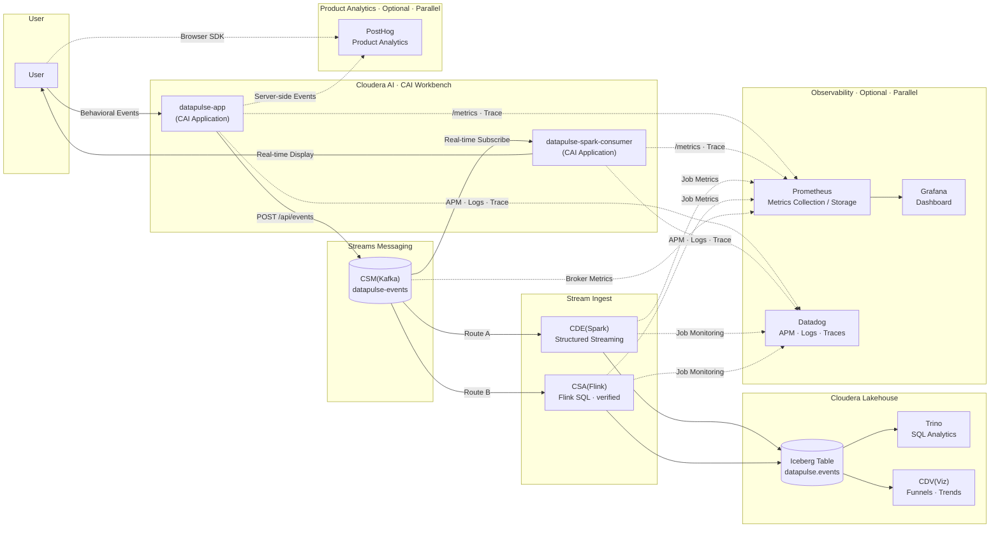

# DataPulse

A PostHog-based user behavior analytics demo. Clicks, page views, and form submissions on the site appear in the event panel (bottom-right) in real time and can sync to PostHog Cloud. On Cloudera AI, events can also be written to Kafka and displayed live by the Spark Consumer Application.

## Target architecture

DataPulse on Cloudera: **real-time event pipeline** and **lakehouse persistence** (both implemented). Kafka is the unified event bus; stream-to-lake uses **CSA (Flink SQL)** in the verified path below, with **CDE (Spark)** as an alternate route.



### Platform components

| Layer | Component | Blueprint / service | Status |
|------|------|------------------|------|
| App hosting | CAI Workbench | `cai` | ✅ Deployed |
| Event production | datapulse-app (CAI Application) | CAI Application | ✅ Verified |
| Message bus | CSM(Kafka) | `csm` | ✅ Verified |
| Real-time consumption | datapulse-spark-consumer (CAI Application) | CAI Application | ✅ Verified |
| Stream ingest A | CDE(Spark) | `cde-udf` | 📋 Planned (alternate) |
| Stream ingest B | CSA(Flink) | `csa` | ✅ Verified (`datapulse_kafka_iceberg`) |
| Lakehouse storage | Iceberg table | `cloudera-lakehouse-engine-governed` | ✅ Verified (`iceberg.datapulse.events`) |
| SQL analytics | Trino | Lakehouse Engine | ✅ Verified |
| Visualization | CDV(Viz) | `cdv` | 📋 Planned (optional) |
| Observability | Observability | Prometheus + Grafana / Datadog, etc. | 📋 Planned (optional) |

### CAI Applications

| Application | Start script | Description |
|-------------|----------|------|
| **datapulse-app** | `scripts/cai_start_application.py` | Demo site + event production |
| **datapulse-spark-consumer** | `scripts/cai_spark_kafka_stream.py` | Kafka consumption + live dashboard |

Producer / Consumer access CSM(Kafka) via Console Access Key (OAuth). **`cai-base-connected` Blueprint is not required** unless connecting to an on-prem CDP Base data lake.

### Four data paths

| Path | Flow | Purpose |
|------|------|------|
| **Real-time** | User → datapulse-app → CSM(Kafka) → spark-consumer → User | Demo, sub-second feedback |
| **Analytics** | CSM(Kafka) → CDE(Spark) **or** CSA(Flink) → Lakehouse → Trino / CDV(Viz) | Historical queries, funnels, retention, reports |
| **Product analytics** | User / datapulse-app → PostHog, etc. | Behavioral tracking, conversion analysis; **parallel** to CSM |
| **Observability** | All layers → **Observability** | Platform and app health monitoring; see table below |

### Observability

The **Observability** module runs **in parallel** with the Cloudera business pipeline. It aggregates monitoring signals focused on **SLI / SLO** (latency, error rate, throughput, resources). It does **not** carry business event analytics, and data does **not** land in Lakehouse business tables.

| Signal | Examples | Integration points | What to observe |
|------|------|--------|----------|
| **Metrics** | Prometheus + Grafana | datapulse-app, spark-consumer, CDE Job, CSA Job, CSM(Kafka) Broker | QPS, P99 latency, consumer lag, job backpressure, CPU / memory |
| **APM / Logs / Traces** | Datadog, Dynatrace, New Relic | Same applications and job layers | Distributed traces, log search, alerts, SLO dashboards |
| **Errors** | Sentry | datapulse-app, spark-consumer | Frontend and backend exception stacks |
| **Alerting** | PagerDuty, Slack | Grafana Alerting / Datadog rules | Ops notifications downstream of Observability |

**Prometheus + Grafana** and **Datadog** are **peers** within Observability: the former suits self-hosted metrics dashboards (e.g. Locust / Kafka lag); the latter suits unified SaaS APM. Use one or both per environment (metrics via Prometheus, traces/logs via Datadog).

### Product Analytics (optional)

Separate from Observability: focuses on **user behavior and business KPIs**, not service health.

| Type | Products | Integration | Data | Relationship to main pipeline |
|------|----------|--------|----------|--------------|
| **Product analytics** | PostHog, Mixpanel, Amplitude | ① User browser (`datapulse-sdk.js`; demo wrapper `analytics.js`)<br/>② datapulse-app server | Clicks, views, conversions | **Parallel** to CSM(Kafka); SaaS only, Kafka only, or dual-write |

**Design principles:**

- **Product Analytics (PostHog, etc.)** → **User / Application layer**; business KPIs; can dual-write with Kafka.
- **Observability (Prometheus / Grafana / Datadog, etc.)** → **Application, Job, CSM layers**; platform and app health.
- **Cloudera main pipeline** (CSM → Lakehouse → Trino / CDV) → **In-platform data assets**; three concerns stay separate.

## Features

- **Page view tracking** — automatic route change capture
- **Custom events** — button clicks, feature usage, plan selection, etc.
- **Form submission** — simulated subscription conversion events
- **User identification** — PostHog `identify` demo
- **Local event panel** — full demo without PostHog configured

## Browser SDK

The embeddable SDK is one file: [`static/js/datapulse-sdk.js`](static/js/datapulse-sdk.js). Loading it sets `window.DataPulse`. It is not the PostHog SDK.

[`static/js/analytics.js`](static/js/analytics.js) is only the demo site's wrapper. It auto-sends `$pageview`, binds `[data-track]` clicks, fills the on-page event panel, and optionally mirrors events to PostHog. Another website does not need that file.

Events POST to `POST /v1/capture` (same handler as `POST /api/events`). The producer accepts them only when Kafka is enabled and configured (`KAFKA_ENABLED=true`); otherwise the endpoint returns 503.

### This app (same origin)

`templates/base.html` loads the SDK, then `analytics.js` calls `init` from `window.DATAPULSE_CONFIG`. To send events yourself:

```html
<script src="/static/js/datapulse-sdk.js"></script>
<script>
  DataPulse.init({
    projectId: "awc-demo",
    endpoint: "/v1/capture",
    pagePath: location.pathname,
    superProperties: { product: "anywhere_cloud" },
  });

  DataPulse.capture("$pageview", { path: location.pathname });
  DataPulse.capture("button_clicked", { button: "signup" });
  DataPulse.identify("user-123", { plan: "pro" });
</script>
```

`projectId` defaults to the `DATAPULSE_PROJECT_ID` env var (`awc-demo` if unset). `endpoint` defaults to `DATAPULSE_CAPTURE_ENDPOINT` (`/v1/capture`).

### Other websites

Copy `static/js/datapulse-sdk.js` onto that site, or load it from the producer, then point `endpoint` at the producer:

```html
<script src="https://<datapulse-app-host>/static/js/datapulse-sdk.js"></script>
<script>
  DataPulse.init({
    projectId: "other-site",
    endpoint: "https://<datapulse-app-host>/v1/capture",
    pagePath: location.pathname,
    superProperties: { site: "other-site" },
  });

  DataPulse.capture("$pageview", { path: location.pathname });
  DataPulse.capture("button_clicked", { button: "signup" });
  DataPulse.identify("user-123", { plan: "pro" });
</script>
```

Call `capture` from your own click handlers. The SDK does not scan the DOM. `analytics.js` is what binds `[data-track]` on the demo site, and only for elements present at `DOMContentLoaded`.

Anonymous id, user id, and session id are stored in the **embedding site's** `localStorage` / `sessionStorage` (`datapulse_anonymous_id`, `datapulse_user_id`, `datapulse_session_id`). They are not shared with the DataPulse demo origin. A session rotates after 30 minutes of idle time.

Cross-origin pages cannot POST to `/v1/capture` today. The SDK uses `sendBeacon`, then `fetch` with `credentials: "same-origin"`, and the producer does not send CORS headers. Keep the relative endpoint `/v1/capture` on the demo origin. For another origin, either enable CORS on `/v1/capture` or proxy the POST through that site's backend.

### API

| Method | What it does |
|--------|----------------|
| `DataPulse.init(options)` | Configure the client. Returns the API object. |
| `DataPulse.capture(name, properties)` | Build and send one event. Returns the event, or `null` if `name` is empty. |
| `DataPulse.identify(userId, traits)` | Save the user id and send `user_identified`. |
| `DataPulse.register(properties)` | Merge properties onto every later event. |
| `DataPulse.trackEvent(name, properties)` | Alias of `capture`. |
| `DataPulse.identifyUser(userId, traits)` | Alias of `identify`. |
| `DataPulse.getAnonymousId()` | Read or create the anonymous id. |
| `DataPulse.getSessionId()` | Read or rotate the session id. |
| `DataPulse.getUserId()` | Identified user id, or `null`. |
| `DataPulse.getSuperProperties()` | Copy of the registered super properties. |

`init` options:

| Option | Default | Meaning |
|--------|---------|---------|
| `projectId` | `"default"` | Sent as `project_id`. |
| `endpoint` | `"/v1/capture"` | Use an absolute URL on another origin. |
| `transportEnabled` | `true` | When `false`, events are built but not sent. The demo sets this from `kafkaEnabled`. |
| `pagePath` | current pathname | Overrides `page_path`. |
| `sessionTimeoutMs` | `1800000` | Idle time before a new session id. |
| `superProperties` | `{}` | Merged into every event's `properties`. |
| `onCapture` | `null` | Called with the event before it is sent. The demo uses this for the local panel. |

`capture` always adds `source: "datapulse-sdk"` and a `context` object (`browser`, `locale`, `referrer`, `pathname`, and `utm` when the URL has `utm_*` params). UTM keys are stored without the `utm_` prefix.

PostHog is optional and is not inside the SDK file. `analytics.js` dual-writes to PostHog only when `POSTHOG_KEY` is set.

## Quick start (FastAPI)

```bash
python -m venv .venv
source .venv/bin/activate
pip install -r requirements.txt
uvicorn app.main:app --reload --host 127.0.0.1 --port 8080
```

Open [http://127.0.0.1:8080](http://127.0.0.1:8080)

## CAI Application deployment

When creating an Application in Cloudera AI Workbench, use the start script:

```bash
scripts/cai-start-application.sh
```

The script reads `CDSW_READONLY_PORT` and starts uvicorn on `127.0.0.1`. Recommended: PBJ Workbench Python 3.11 runtime.

Set the Application `script` field to `scripts/cai_start_application.py` or `scripts/start_datapulse.py` (PBJ Python runtime executes scripts as Python code, not bash; use `os.getcwd()` instead of `__file__`, and do not wrap uvicorn in `raise SystemExit`).

## Day-to-day CAI deployment

After code changes: **upload → delete + recreate**. Do not use `:restart` (can hang in `APPLICATION_STARTING` and leave orphan engine sessions).

```bash
export CAI_BASE=https://<your-cai-domain>
export CAI_PID=<project-id>
export CAI_KEY=$CDSW_APIV2_KEY

# One-shot: upload files + recreate all Applications
python3 scripts/cai_deploy.py

# Or step by step
python3 scripts/cai_upload_files.py
python3 scripts/cai_recreate_applications.py

# Recreate a single app (e.g. producer)
python3 scripts/cai_recreate_applications.py --apps datapulse-app
```

`cai_recreate_applications.py` finds Applications by name, snapshots runtime / env / subdomain, deletes the old instance, and creates a new one (`environment` submitted as an object). If the monitoring subdomain changes, update `GRAFANA_ROOT_URL` / `GRAFANA_DOMAIN` in `datapulse.env`.

## Configure PostHog (optional)

1. Sign up at [PostHog](https://posthog.com) and create a project
2. Copy the Project API Key
3. Set environment variables:

```env
POSTHOG_KEY=phc_your_project_api_key_here
POSTHOG_HOST=https://us.i.posthog.com
```

4. Run `python3 scripts/cai_recreate_applications.py --apps datapulse-app` to apply

When configured, the event panel shows “PostHog connected” and events sync to PostHog Live Events.

## Configure Kafka OAuth (optional)

1. In Surveyor, open Kafka **CLIENT_CONFIGS** and download `kafka-ca.crt` and `oauth-ca.crt` to `config/kafka/`
2. In Console API Explorer, create an Access Key (`POST /api/v0/auth/access-keys/credentials`)
3. Set environment variables:

```env
KAFKA_ENABLED=true
KAFKA_CLIENT_ID=your-client-id
KAFKA_CLIENT_SECRET=your-client-secret
KAFKA_TOPIC=datapulse-events
KAFKA_BOOTSTRAP_SERVERS=csm-bp-kafka.cldr-csk-csm-1.a70735.test.cldr.work:8443
KAFKA_TOKEN_URL=https://console.readygo.a70735.test.cldr.work/api/v0/auth/access-keys/token
KAFKA_CONFIG_DIR=config/kafka
```

4. Run `python3 scripts/cai_recreate_applications.py --apps datapulse-app`. Browser events are written to Kafka via `POST /api/events` or `POST /v1/capture`.

The CAI Application start script auto-downloads the Kafka CLI when `KAFKA_ENABLED=true` (`KAFKA_HOME`).

### Spark Consumer Application

Create a second CAI Application with start script `scripts/cai_spark_kafka_stream.py` and the same Kafka OAuth env vars as the Producer. Recommended runtime addon: `sparkconnect354-731-26` (falls back to Kafka CLI when Spark Connect is unavailable).

### Lakehouse: Kafka → Iceberg (standalone CAI Job)

**Do not** put lake ingest logic in the `datapulse-spark-consumer` Application. The Consumer only powers the in-memory live dashboard; historical analytics go through Lakehouse.

| Component | Role |
|------|------|
| CSM(Kafka) `datapulse-events` | Event bus (Producer already writes here) |
| CAI Job `datapulse-lakehouse-kafka-ingest` | Spark Structured Streaming + `foreachBatch` → Iceberg |
| Lakehouse HMS + Ozone | `iceberg_catalog.datapulse.events` metadata and storage |
| Trino (`lakehouse-bp-trino`) | SQL validation and funnel/retention analysis |

Recommended path (matches architecture diagram above):

```
Kafka(datapulse-events) → Spark Job(foreachBatch) → Iceberg(datapulse.events) → Trino SQL
```

**Isolated testing** (does not affect existing Applications):

```bash
export CAI_BASE=https://ray-ml.cldr-csk-cai-readygo.a70735.test.cldr.work
export CAI_PID=k87h-zej9-dugs-473y
export CAI_KEY=$CDSW_APIV2_KEY

# Upload new scripts
python3 scripts/cai_upload_files.py

# 1) discover — print HMS / warehouse / Kafka config
python3 scripts/cai_submit_lakehouse_job.py ensure-and-run --mode discover

# 2) bootstrap — create Iceberg table (requires sparkconnect addon)
python3 scripts/cai_submit_lakehouse_job.py ensure-and-run --mode bootstrap

# 3) batch — run one micro-batch write
python3 scripts/cai_submit_lakehouse_job.py ensure-and-run --mode batch

# 4) verify — row count and sample rows
python3 scripts/cai_submit_lakehouse_job.py ensure-and-run --mode verify
```

Job entry: `scripts/cai_lakehouse_discover_only.py` → `jobs/kafka_to_iceberg.py`  
Note: CAI PBJ runtime job scripts must not use `raise SystemExit()` or the UI shows `ENGINE_FAILED`.

Runtime addons: `discover` only needs `hadoop-cli-7.3.1.709-1`; `bootstrap/batch/stream/verify` also need `sparkconnect354-731-26`

Common Lakehouse environment variables (override with `--env KEY=VALUE`):

```env
HIVE_METASTORE_URI=thrift://hivemetastore.cldr-csk-lakehouse.a70735.test.cldr.work:9083
ICEBERG_WAREHOUSE=s3a://s3v/warehouse/datapulse
ICEBERG_CATALOG=iceberg_catalog
ICEBERG_DATABASE=datapulse
ICEBERG_TABLE=events
```

After a successful write, query in Trino Admin UI:

```sql
SELECT event_name, user_id, anonymous_id, event_timestamp
FROM iceberg_catalog.datapulse.events
ORDER BY ingested_at DESC
LIMIT 20;
```

> Iceberg **Structured Streaming sink** is still Technical Preview on some CDE versions. This job uses **`foreachBatch` + `writeTo(...).append()`**, matching the Consumer Spark path for easier incremental validation on CAI.

### Lakehouse: Kafka → Iceberg (CSA Flink SQL — verified path)

Production stream ingest runs on **CSA (SSB)** as a long-lived Flink SQL job, not the CAI Trino cron job:

```
Kafka(datapulse-events) → CSA Flink SQL → Iceberg(datapulse.events) → Trino SQL
```

| Item | Value |
|------|-------|
| CSA job | `datapulse_kafka_iceberg` (SSB job id **5195**) |
| Iceberg table | `iceberg.datapulse.events` |
| Scripts | `scripts/csa_flink_kafka_iceberg.py`, `scripts/csa_patch_flink_lakehouse_conf.sh`, `scripts/csa_patch_flink_kafka_oauth.sh` |

Cluster prep (run once on bastion with kubeconfigs):

```bash
bash scripts/csa_patch_flink_kafka_oauth.sh
bash scripts/csa_patch_flink_lakehouse_conf.sh   # HMS conf, Ozone S3 TLS, checkpoint dir
python3 scripts/ranger_grant_hive.py             # Iceberg RWSTORAGE for HMS commits
```

Run / status:

```bash
CSA_ICEBERG_DATABASE=datapulse CSA_ICEBERG_TABLE=events \
  python3 scripts/csa_flink_kafka_iceberg.py run --job-id 5195
python3 scripts/csa_flink_kafka_iceberg.py status --job-id 5195
```

Trino validation:

```sql
SELECT count(*), max(ingested_at) FROM iceberg.datapulse.events;
```

The CAI Job `datapulse-lakehouse-kafka-ingest` (`trino-ingest` mode) remains available for micro-batch fallback; pause its cron when Flink streaming is active.

### Monitoring Application (Prometheus + Grafana)

Third CAI Application for Observability; start script: `scripts/cai_start_monitoring.py`.

**Sync CAI Project with `main`**: see [docs/cai-main-sync.md](docs/cai-main-sync.md). On `main`, run `python3 scripts/cai_project_sync.py upload` (do not upload directly from feature branches).

| Item | Value |
|----|-----|
| Application name | `datapulse-monitoring` |
| Script | `scripts/cai_start_monitoring.py` |
| Public UI | Grafana (CAI-assigned subdomain, e.g. `datapulse-mon-xxxxxx.<domain>`) |

Environment variables (recommended in **Project → Settings → Engine**, loaded by all Applications at start; or place `datapulse.env` at project root as fallback):

```env
CDSW_APP_POLLING_ENDPOINT=/
PRODUCER_URL=https://datapulse-app.<your-domain>
CONSUMER_URL=https://datapulse-spark-consumer.<your-domain>
GRAFANA_ROOT_URL=https://datapulse-mon-xxxxxx.<your-domain>/
GRAFANA_DOMAIN=datapulse-mon-xxxxxx.<your-domain>
MONITORING_VERIFY_SSL=false
WAIT_TIMEOUT=300
```

`CDSW_APP_POLLING_ENDPOINT=/` is required for CAI to mark the Application RUNNING (see WebSessions Locust Dashboard). Grafana binds directly to `CDSW_READONLY_PORT`; no extra HTTP proxy.

The Monitoring Application itself only needs `MONITORING_VERIFY_SSL=false` (other vars inherit from the Project). The Exporter scrapes Producer / Consumer via in-pod `DS_RUNTIME_*_PORT_8100_TCP_ADDR` (Applications must bind `0.0.0.0:CDSW_READONLY_PORT`).

**Access URL:** In Workbench **Applications**, click **Open** on `datapulse-monitoring` (subdomain like `datapulse-mon-xxxxxx.<domain>`, assigned at create time). If `nslookup` returns NXDOMAIN, internal DNS may not be synced yet—delete and recreate the Application to trigger registration; confirm `datapulse-app.<domain>` resolves to rule out network issues.

In-pod components:

- `DataPulseExporter.py` — aggregates Producer / Consumer `/health` and `/metrics` (relay to Prometheus)
- Prometheus — scrapes `localhost:9191`
- Grafana — prebuilt **DataPulse Overview** dashboard

Producer / Consumer expose `GET /metrics` (Prometheus format). Local debugging:

```bash
bash monitoring/download.sh
PRODUCER_URL=http://127.0.0.1:8080 CONSUMER_URL=http://127.0.0.1:8081 bash monitoring/start.sh
```

## Project structure

```
app/
  main.py                  # Producer FastAPI routes
  config.py                # Environment configuration
  kafka_settings.py        # Kafka OAuth settings
  api/events.py            # POST /v1/capture and POST /api/events
  services/kafka_producer.py
  spark_stream/            # Consumer Application
    kafka_stream.py        # Spark Connect probe + Kafka CLI consumer
    web.py                 # Consumer Web UI
    store.py               # In-memory event store
config/kafka/              # Surveyor certs and client properties
templates/                 # Producer Jinja2 page templates
static/
  css/styles.css
  js/datapulse-sdk.js      # Embeddable browser SDK (window.DataPulse)
  js/analytics.js          # Demo auto-tracking, event panel, optional PostHog
scripts/
  cai_deploy.py                 # upload + recreate one-shot deploy
  cai_upload_files.py             # Upload project files to Workbench
  cai_recreate_applications.py    # delete + create Application rebuild
  cai_stop_applications.py        # stop only (debug; use recreate for daily deploy)
  cai_start_application.py        # Producer CAI start script
  cai_spark_kafka_stream.py       # Consumer CAI start script
  cai_lakehouse_ingest_job.py     # Lakehouse ingest CAI Job entry (standalone)
  cai_submit_lakehouse_job.py     # Create/run Lakehouse Job (no Application changes)
  cai_start_monitoring.py         # Monitoring CAI start script
jobs/
  kafka_to_iceberg.py            # Spark Kafka -> Iceberg logic
requirements-spark.txt     # Consumer dependencies
monitoring/                # Prometheus + Grafana + DataPulse exporter
  DataPulseExporter.py
  prometheus.yml
  start.sh
  download.sh
templates/                 # FastAPI Jinja2 site (Producer)
static/                    # Producer static assets
app/live/                  # Consumer live dashboard templates + static
```

## Tech stack

- FastAPI + Jinja2 (Producer site + Consumer dashboards)
- Kafka OAuth (CSM / Strimzi)
- Spark Connect + Kafka CLI fallback (Consumer)
- CSA Flink SQL → Iceberg (verified lakehouse ingest path)
- Cloudera Lakehouse + Iceberg + Trino + CDV(Viz)
- Observability: Prometheus + Grafana / Datadog (optional, parallel to main pipeline)
- PostHog (browser SDK CDN, optional, Product Analytics)
